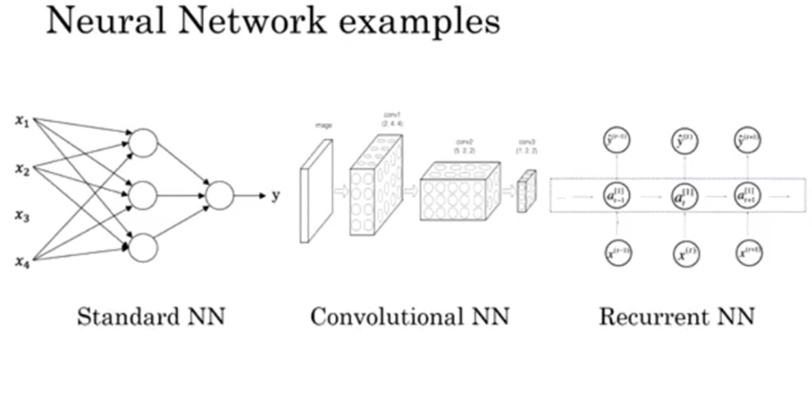

# Personal Notes
## Sources: [Coursera 1](https://www.coursera.org/learn/neural-networks-deep-learning/home/week/1) , [Coursera 2](https://www.coursera.org/learn/convolutional-neural-networks/home/week/1) , [Youtube](https://www.youtube.com/watch?v=CS4cs9xVecg&list=PLkDaE6sCZn6Ec-XTbcX1uRg2_u4xOEky0)
---
>## Lecture 1:

### A neural network consists of:
* **Input layer.**
* **Hidden layers :** Takes input from Input layer.
* **Output layer :** Takes input from the final Hidden layer.

### ReLU function: Rectified Linear Unit function\
It is a function which has a value 0 until a specified value, and then it follows the line x=y

---
>## Lecture 2:

### Supervised Learning:
* Input given
* Output known or labelled

### Unsupervised Learning:
* Input given
* Output **NOT** labelled / known

### Types of Neural Networks:
 1. **Standard Neural Network:** eg: used in predicting house prices.
 2. **Convolutional Neural Network:** eg: used in Image applications.
 3. **Recurrent Neural Network:** eg: used in sequential 1D data such as audio.
 
 

 ### Structured Data:
 * Database of Input features is available eg: tabular form, etc.
 
 ### Unstructured Data:
 * Input features are available as images, audio, Text etc.
 * Here the input features are pixel values, letters etc.

 ---
 >## Lecture 3:
* Neural Networks need *more data* or *better models* for **Good accuracy**.
* "*Better Models*" refers to Higher number of parameters, layers etc.
* After some amount of data, the accuracy plateaus (remains almost constant).