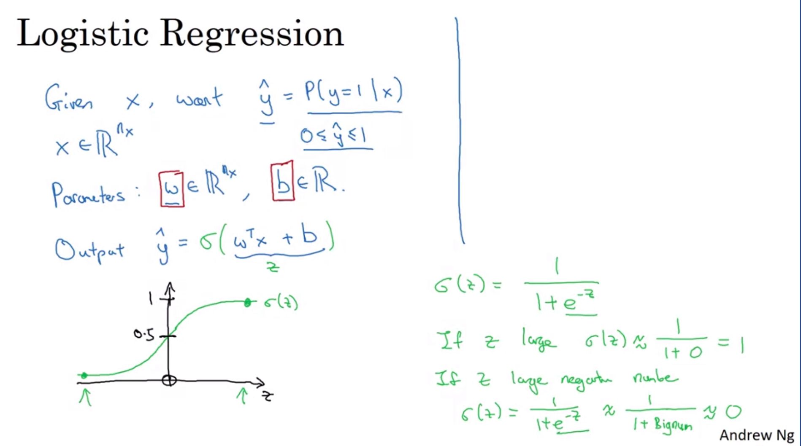

# Personal Notes
## Sources: [Coursera 1](https://www.coursera.org/learn/neural-networks-deep-learning/home/week/1) , [Coursera 2](https://www.coursera.org/learn/convolutional-neural-networks/home/week/1) , [Youtube](https://www.youtube.com/watch?v=CS4cs9xVecg&list=PLkDaE6sCZn6Ec-XTbcX1uRg2_u4xOEky0)
---

# WEEK 1:
---
>## Lecture 1:

### A neural network consists of:
* **Input layer.**
* **Hidden layers :** Takes input from Input layer.
* **Output layer :** Takes input from the final Hidden layer.

---
>## Lecture 2:

### Supervised Learning:
* Input given
* Output known or labelled

### Unsupervised Learning:
* Input given
* Output **NOT** labelled / known

### Types of Neural Networks:
 1. **Standard Neural Network:** eg: used in predicting house prices.
 2. **Convolutional Neural Network:** eg: used in Image applications.
 3. **Recurrent Neural Network:** eg: used in sequential 1D data such as audio.
 
 

 ### Structured Data:
 * Database of Input features is available eg: tabular form, etc.
 
 ### Unstructured Data:
 * Input features are available as images, audio, Text etc.
 * Here the input features are pixel values, letters etc.

 ---
 >## Lecture 3:
* Neural Networks need *more data* or *better models* for **Good accuracy**.
* "*Better Models*" refers to Higher number of parameters, layers etc.
* After some amount of data, the accuracy plateaus (remains almost constant).

---
# WEEK 2: 
---

>## Lecture 1:

### Binary Classification:
* output is one of 2 possibilities.

### Image representation:
* A coloured image is represented by a matrix of 3 dimensions: \
**(no of rows, no of columns, 3 colour channels)**

* These 3 channels contain colour intensities of red, green, blue.

* This Matrix is converted to a single dimension array containing all the pixels of each channel, called as **Feature Vector (X )**.
* A Feature Vector has **Nx** number of rows (total number of pixels).
* Each pixel of is a **Neuron**
---
# NOTATIONS:
* ### **Note**: Capital Case and Small Case notations are *different*. 
* Each testing or training example is represented by **(x,y)**:
    * **x** : Feature Vector of the example.
    * **y** : output when passed through the neural network (0 or 1 in case of Binary Classification).
* **(x<sup>i</sup> , y<sup>i</sup>)** represents **i<sup>th</sup>** *Testing example*.
* **i** belong to **1 to m**, where **m** is the number of training examples
* **X** is a matrix having **Nx** number of rows and **m** columns.
* **Y** matrix is the matrix containing outputs of each example.
* **Y** has m columns (shape is (1,m)).
* **p** is the probability that y = 1 with input x. 
* **w** is **weight** corresponding to each pixel/ neuron 
* **b** is **bias** corresponding to each neuron eqn.
---
>## Lecture 2:
## LOGISTIC REGRESSION  
* ## **p = sig(w<sup>T</sup>x + b)**
* ### Here, **z = w<sup>T</sup>x + b**
* ### Hence, p = sig(z))
* ### Sig is a function which bounds the sum between 0 and 1, because p is a probability hence it lies between 0 and 1.

* This function can be sigmoid, ReLU, etc.
* ### ReLU function: Rectified Linear Unit function
    It is a function which has a value 0 until a certain value, and then it follows the line x=y




---
>## Lecture 3:
## COST FUNCTION

* ### **Loss** is the deviation of p from y.

* It is preferable that the loss function is a **convex function**, for finding global minima relatively easily.

* Loss function used here is:
    ## **L(p,y) = -( ylog(p) + (1-y) log(1-p) )**

* Loss is measured over each training example.
* **Cost function** is measured over entire training set.
    ## **cost = avg(loss over of each example)**
---
>## Lecture 4:
## GRADIENT DESCENT

* Gradient descent is used to reduce the value of Loss function L, which is a function of 2 variables: w and b.
* This is done by finding the minima of the function L(w,b).
* ## **w = w - a(dw)**
    * Where a is the **learning rate**.
    * **dw** is the **Partial derivative**: *rate of change of L wrt w*: **dL(w,b)/dw**
* ## **b = b - a(db)**
    * **db** is the **Partial derivative**: *rate of change of L wrt b*: **dL(w,b)/db**

* **Forward Propogation:** Calculating the output based on the input.
* **Backward Propogation:** Improvising on the basis of Output obtained and Output desired.
---
## Application:
* Avoid using for loop; use **Vectorization** instead by using **Matrices**. 
* z = w<sup>T</sup>x + b
    * Here, w<sup>T</sup> and x both are Matrices.
* instead of using for loop to multiply the 2 matrices, use inbuilt function instead.
    ```
    import numpy as np
    z = np.dot(w,x) + b
    ```
* **np.zeros()** function.
    * it can be used for summation.
    * it creates an array of mentioned size with each element 0.
* **np.exp()** 
    * is used to exponent each element of a matrix.
* **np.log()**
    * used to log each element of a matrix.
* **np.sum(axis = t)** is used to compute the of the elements of the matrix in a particular direction.
    * t = 0: vertical sum (c1 sum, c2 sum ,etc)
    * t = 1: horizontal sum (r1 sum, r2 sum, etc)
* **matrix.T** Transposes the said matrix
* check documentation of **Numpy** library for more functions.
---
**Note:** For derivatives, differentiate the function on paper and then formulize it in code (cannot differentiate in code using any function).

---
 # Jupyter Notebook:
 * **shift+enter:** run a code block
 * supports markdown language
 * restart kernel to stop running the code.
 